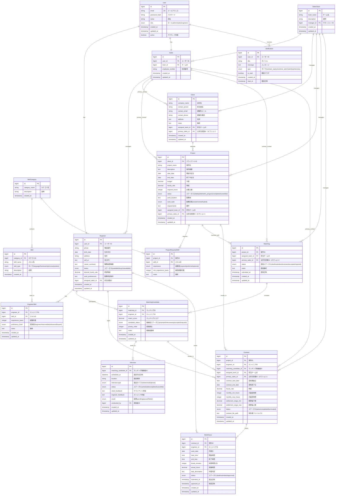

```mermaid
erDiagram
    %% ユーザー関連
    User {
        bigint id PK
        string email UK "メールアドレス"
        string password_hash "パスワード"
        string name "氏名"
        enum role "ロール(admin/sales/engineer)"
        timestamp created_at
        timestamp updated_at
        boolean active "アクティブ状態"
    }

    SalesTeam {
        bigint id PK
        string team_name "チーム名"
        string description "説明"
        bigint manager_id FK "マネージャーID"
        timestamp created_at
        timestamp updated_at
    }

    Engineer {
        bigint id PK
        bigint user_id FK "ユーザーID"
        string phone "電話番号"
        date birth_date "生年月日"
        string address "住所"
        text self_pr "自己PR"
        text career_summary "職務経歴概要"
        enum status "ステータス(available/busy/unavailable)"
        decimal desired_hourly_rate "希望時給"
        text work_preferences "勤務希望条件"
        bigint assigned_sales_id FK "担当営業ID"
        timestamp created_at
        timestamp updated_at
    }

    Sales {
        bigint id PK
        bigint user_id FK "ユーザーID"
        bigint team_id FK "チームID"
        string employee_number "社員番号"
        timestamp created_at
        timestamp updated_at
    }

    %% スキル関連
    SkillCategory {
        bigint id PK
        string category_name "カテゴリ名"
        string description "説明"
        timestamp created_at
    }

    Skill {
        bigint id PK
        bigint category_id FK "カテゴリID"
        string skill_name "スキル名"
        enum skill_type "タイプ(language/framework/process/position)"
        string description "説明"
        timestamp created_at
    }

    EngineerSkill {
        bigint id PK
        bigint engineer_id FK "エンジニアID"
        bigint skill_id FK "スキルID"
        integer experience_years "経験年数"
        enum proficiency_level "習熟度(beginner/intermediate/advanced/expert)"
        text notes "備考"
        timestamp created_at
        timestamp updated_at
    }

    %% クライアント・案件関連
    Client {
        bigint id PK
        string company_name "会社名"
        string contact_person "担当者名"
        string contact_email "連絡先メール"
        string contact_phone "連絡先電話"
        text address "住所"
        text notes "備考"
        bigint assigned_team_id FK "担当チームID"
        bigint primary_sales_id FK "主担当営業ID（オプション）"
        timestamp created_at
        timestamp updated_at
    }

    Project {
        bigint id PK
        bigint client_id FK "クライアントID"
        string project_name "案件名"
        text description "案件概要"
        date start_date "開始予定日"
        date end_date "終了予定日"
        decimal budget "予算"
        decimal hourly_rate "時給"
        integer required_hours "必要工数"
        enum status "ステータス(draft/published/in_progress/completed/cancelled)"
        text work_location "勤務地"
        enum work_style "勤務形態(onsite/remote/hybrid)"
        text requirements "要件"
        bigint assigned_team_id FK "担当チームID"
        bigint primary_sales_id FK "主担当営業ID（オプション）"
        timestamp created_at
        timestamp updated_at
    }

    ProjectRequiredSkill {
        bigint id PK
        bigint project_id FK "案件ID"
        bigint skill_id FK "スキルID"
        enum importance "重要度(required/preferred/optional)"
        integer min_experience_years "最低経験年数"
        text notes "備考"
    }

    %% マッチング・提案関連
    Matching {
        bigint id PK
        bigint project_id FK "案件ID"
        bigint assigned_team_id FK "担当チームID"
        bigint primary_sales_id FK "主担当営業ID（オプション）"
        enum status "提案ステータス(draft/submitted/reviewed/accepted/rejected)"
        text notes "提案備考"
        timestamp submitted_at "提案日時"
        timestamp created_at
        timestamp updated_at
    }

    MatchingCandidate {
        bigint id PK
        bigint matching_id FK "マッチングID"
        bigint engineer_id FK "エンジニアID"
        decimal match_score "マッチングスコア"
        enum candidate_status "候補者ステータス(proposed/interviewing/accepted/rejected)"
        integer priority_order "提案順位"
        text notes "候補者備考"
        timestamp created_at
        timestamp updated_at
    }

    Interview {
        bigint id PK
        bigint matching_candidate_id FK "マッチング候補者ID"
        datetime scheduled_at "面談予定日時"
        string location "面談場所"
        enum interview-type "面談タイプ(online/onsite/phone)"
        enum status "ステータス(scheduled/completed/cancelled)"
        text client_feedback "クライアント評価"
        text engineer_feedback "エンジニア評価"
        enum result "結果(pending/passed/failed)"
        bigint conducted_by FK "実施者ID"
        timestamp created_at
        timestamp updated_at
    }

    %% 契約・工数関連
    Contract {
        bigint id PK
        bigint project_id FK "案件ID"
        bigint engineer_id FK "エンジニアID"
        bigint matching_candidate_id FK "マッチング候補者ID"
        bigint assigned_team_id FK "担当チームID"
        bigint primary_sales_id FK "主担当営業ID（オプション）"
        date contract_start_date "契約開始日"
        date contract_end_date "契約終了日"
        decimal hourly_rate "時給"
        integer monthly_min_hours "月最低時間"
        integer monthly_max_hours "月最高時間"
        decimal settlement_range_min "精算幅下限"
        decimal settlement_range_max "精算幅上限"
        enum status "ステータス(active/completed/terminated)"
        text contract_file_path "契約書ファイルパス"
        timestamp created_at
        timestamp updated_at
    }

    WorkHours {
        bigint id PK
        bigint contract_id FK "契約ID"
        bigint engineer_id FK "エンジニアID"
        date work_date "作業日"
        time start_time "開始時間"
        time end_time "終了時間"
        integer break_minutes "休憩時間(分)"
        decimal actual_hours "実働時間"
        text task_description "作業内容"
        enum status "ステータス(draft/submitted/approved)"
        timestamp submitted_at "提出日時"
        timestamp approved_at "承認日時"
        timestamp created_at
        timestamp updated_at
    }

    %% 通知関連
    Notification {
        bigint id PK
        bigint user_id FK "ユーザーID"
        string title "タイトル"
        text message "メッセージ"
        enum type "タイプ(contract_expiry/overtime_alert/matching/interview)"
        boolean is_read "既読フラグ"
        timestamp created_at
        timestamp read_at "既読日時"
    }

    %% リレーション定義
    User ||--|| Engineer : "has"
    User ||--|| Sales : "has"
    User ||--o{ Notification : "receives"

    SalesTeam ||--o{ Sales : "belongs_to"
    SalesTeam ||--o{ Client : "manages"
    SalesTeam ||--o{ Project : "manages"
    SalesTeam ||--o{ Matching : "manages"
    SalesTeam ||--o{ Contract : "manages"
    Sales ||--o{ Engineer : "manages"
    Sales ||--o{ Client : "primary_contact"
    Sales ||--o{ Project : "primary_contact"
    Sales ||--o{ Matching : "primary_contact"
    Sales ||--o{ Contract : "primary_contact"

    Engineer ||--o{ EngineerSkill : "has"
    Engineer ||--o{ MatchingCandidate : "participates"
    Engineer ||--o{ Contract : "signs"
    Engineer ||--o{ WorkHours : "tracks"

    SkillCategory ||--o{ Skill : "contains"
    Skill ||--o{ EngineerSkill : "used_in"
    SkillCategory ||--o{ ProjectRequiredSkill : "required_for"

    Client ||--o{ Project : "requests"

    Project ||--o{ ProjectRequiredSkill : "requires"
    Project ||--o{ Matching : "matched_with"
    Project ||--o{ Contract : "results_in"

    Matching ||--o{ MatchingCandidate : "includes"

    MatchingCandidate ||--o{ Interview : "leads_to"
    MatchingCandidate ||--o{ Contract : "results_in"

    Contract ||--o{ WorkHours : "tracks"
```
